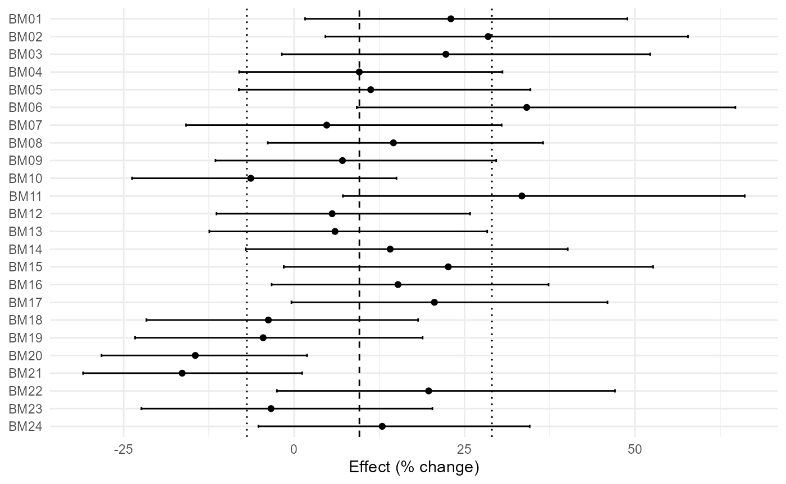
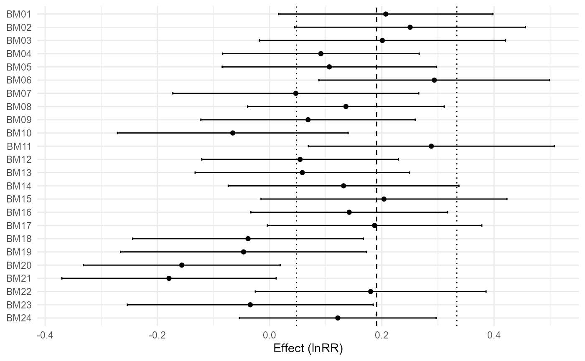
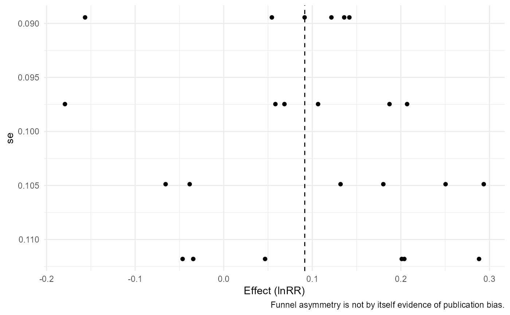
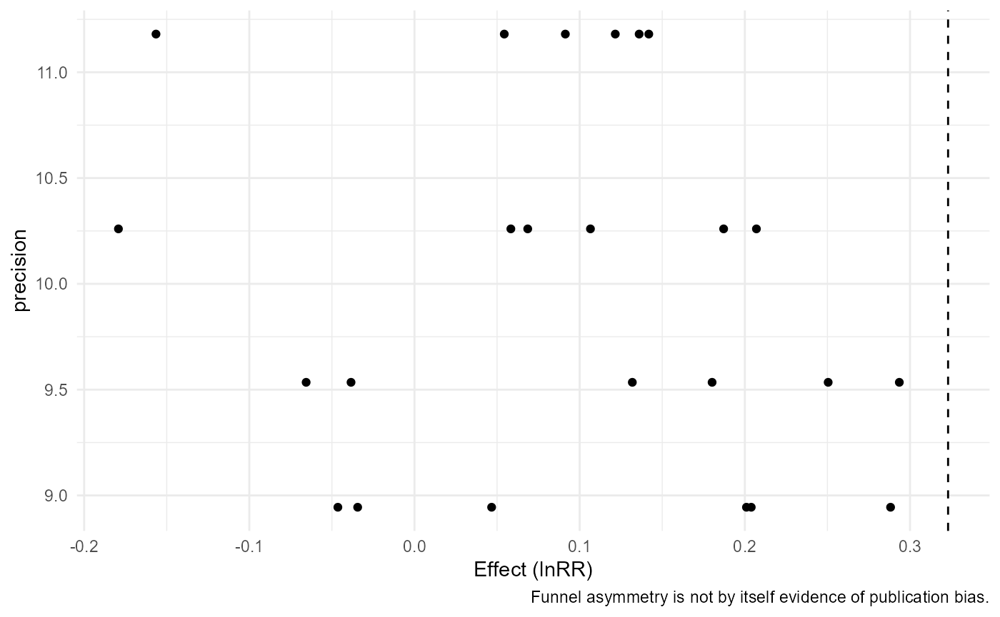

# Random Effects, Heterogeneity, Prediction, and Practical Relevance

## Three model settings

``` r

m1 <- apm_fit(agri_effects_benchmark)
m2 <- apm_fit(agri_effects_benchmark,model="common")
m3 <- apm_fit(agri_effects_benchmark,mods=~rainfall,model="mixed")
```

``` r

h1 <- apm_heterogeneity(m1,ci=FALSE)
h2 <- apm_heterogeneity(m2,ci=FALSE)
h3 <- apm_heterogeneity(m3,ci=FALSE)
```

## Prediction

``` r

apm_prediction(m1,transform="percent")
#> <apm_prediction> transform=percent
#>      pred         se ci_lower ci_upper  pi_lower pi_upper
#>  9.581184 0.02609049 4.118456 15.33052 -6.925962 29.01595
apm_prediction(m3,newdata=data.frame(rainfall=c(600,900,1200)),transform="percent")
#> <apm_prediction> transform=percent
#>       pred         se  ci_lower  ci_upper  pi_lower pi_upper
#>  19.095657 0.04039360 10.030434 28.907748  3.892933 36.52300
#>  10.584561 0.02380854  5.542804 15.867161 -1.985451 24.76663
#>   2.681705 0.03453616 -4.038762  9.872829 -9.857939 16.96574
apm_prediction(m1,transform="exp")
#> <apm_prediction> transform=exp
#>      pred         se ci_lower ci_upper  pi_lower pi_upper
#>  1.095812 0.02609049 1.041185 1.153305 0.9307404  1.29016
```

## Agronomic thresholds

``` r

apm_threshold(m1,5,"percent")
#> <apm_threshold>
#> threshold: 5 [ percent ]
#> CI: crosses threshold 
#> PI: crosses threshold 
#> probability: 0.696
apm_threshold(m1,1.10,"ratio")
#> <apm_threshold>
#> threshold: 1.1 [ ratio ]
#> CI: crosses threshold 
#> PI: crosses threshold 
#> probability: 0.482
apm_threshold(m1,0,"model","less")
#> <apm_threshold>
#> threshold: 0 [ model ]
#> CI: entirely above threshold 
#> PI: crosses threshold 
#> probability: 0.136
```

## Subgroups and figures

``` r

apm_subgroup(agri_effects_benchmark,crop,test="z")
#> <apm_subgroup>
#>  subgroup k   estimate         se    ci_lower  ci_upper   pi_lower  pi_upper
#>     maize 8 0.08643770 0.05243914 -0.01634113 0.1892165 -0.1505993 0.3234746
#>   soybean 8 0.08415367 0.03530365  0.01495980 0.1533475  0.0149598 0.1533475
#>     wheat 8 0.10958704 0.05273047  0.00623722 0.2129369 -0.1296627 0.3488368
#> Omnibus subgroup test:
#>         QM df       QMp
#>  0.1950858  2 0.9070634
apm_subgroup(agri_effects_benchmark,soil_texture,test="z")
#> <apm_subgroup>
#>  subgroup k   estimate         se    ci_lower  ci_upper   pi_lower  pi_upper
#>      clay 8 0.10958704 0.05273047  0.00623722 0.2129369 -0.1296627 0.3488368
#>      loam 8 0.08415367 0.03530365  0.01495980 0.1533475  0.0149598 0.1533475
#>     sandy 8 0.08643770 0.05243914 -0.01634113 0.1892165 -0.1505993 0.3234746
#> Omnibus subgroup test:
#>         QM df       QMp
#>  0.1950858  2 0.9070634
apm_subgroup(agri_effects_benchmark,cut(rainfall,3),test="z")
#> <apm_subgroup>
#>             subgroup k    estimate         se    ci_lower  ci_upper    pi_lower
#>            (534,803] 8 0.162886003 0.03530365  0.09369213 0.2320799  0.09369213
#>       (803,1.07e+03] 8 0.103796753 0.03531418  0.03458223 0.1730113  0.03442177
#>  (1.07e+03,1.34e+03] 8 0.004110183 0.05233673 -0.09846792 0.1066883 -0.23214699
#>   pi_upper
#>  0.2320799
#>  0.1731717
#>  0.2403674
#> Omnibus subgroup test:
#>        QM df        QMp
#>  8.085794  2 0.01754657

apm_forest(m1,transform="percent")
#> `height` was translated to `width`.
```



``` r

apm_forest(m1,transform="exp",columns="crop")
#> `height` was translated to `width`.
```


``` r

apm_forest(m3,transform="none")
#> `height` was translated to `width`.
```



``` r


apm_funnel(m1)
```



``` r

apm_funnel(m1,contour=TRUE)
```


``` r

apm_funnel(m3,yaxis="precision")
```



``` r


apm_table(m1,"model")
#>            term estimate    se ci_lower ci_upper
#> intrcpt intrcpt    1.096 0.026    1.041    1.153
apm_table(h1,"heterogeneity")
#>    k      Q Q_df   Q_p  tau2   tau     I2    H2
#> 1 24 37.477   23 0.029 0.006 0.079 38.534 1.627
apm_table(m3,"model",transform="percent")
#>              term estimate    se ci_lower ci_upper
#> intrcpt   intrcpt   38.133 0.094   14.894   66.073
#> rainfall rainfall   -0.025 0.000   -0.044   -0.006
```
