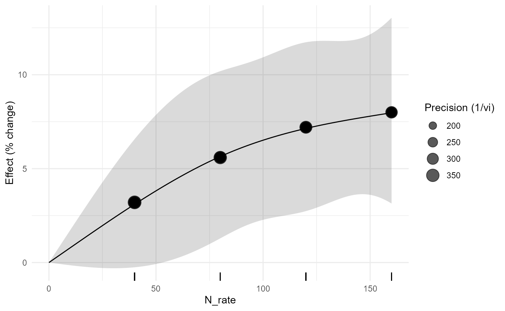
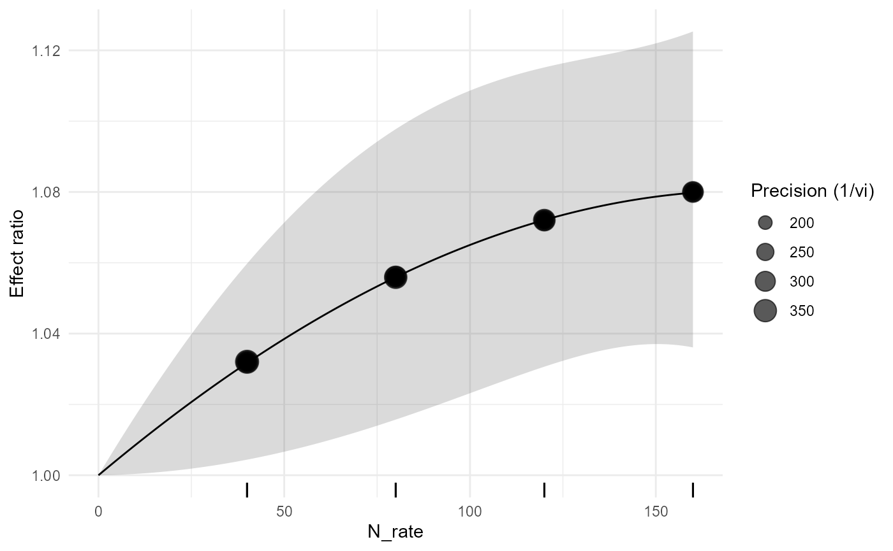

# Correlated Dose-Response Meta-analysis for Agronomic Experiments

## 1. Why dose-response is not ordinary meta-regression

Suppose one nitrogen experiment compares 40, 80, 120, and 160 kg N/ha
with the same zero-N control. The four effect sizes share information
from that control. They are therefore statistically correlated. A
regression of all effect sizes on nitrogen rate that assumes independent
sampling errors does not represent the design correctly.

[`apm_dose_response()`](https://wep69.github.io/agriPairMetaFlow/reference/apm_dose_response.md)
is reserved for this multi-dose structure. Version 0.3.0 routes
random-effects dose-response curves through `dosresmeta`. When that
optional backend is absent, only a covariance-aware fixed-effect GLS
route is available through `metafor`; a random-intercept model is
deliberately not treated as equivalent to random dose-response
coefficients. Runtime validation of the optional random-effects route is
performed locally.

## 2. Inspect the teaching data

``` r

head(fertilizer_dose_response)
#>   study_id experiment_id   dose_id effect_id control_id  crop soil_texture
#> 1     FD01        FD01E1  FD01_N40  FD01_N40    FD01_N0 maize         loam
#> 2     FD01        FD01E1  FD01_N80  FD01_N80    FD01_N0 maize         loam
#> 3     FD01        FD01E1 FD01_N120 FD01_N120    FD01_N0 maize         loam
#> 4     FD01        FD01E1 FD01_N160 FD01_N160    FD01_N0 maize         loam
#> 5     FD02        FD02E1  FD02_N40  FD02_N40    FD02_N0 wheat         clay
#> 6     FD02        FD02E1  FD02_N80  FD02_N80    FD02_N0 wheat         clay
#>   N_rate treatment control mean_t  sd_t n_t mean_c sd_c n_c treatment_id
#> 1     40       N40      N0  3.922 0.408   4    3.8 0.42   4     FD01_N40
#> 2     80       N80      N0  4.013 0.436   4    3.8 0.42   4     FD01_N80
#> 3    120      N120      N0  4.074 0.464   4    3.8 0.42   4    FD01_N120
#> 4    160      N160      N0  4.104 0.492   4    3.8 0.42   4    FD01_N160
#> 5     40       N40      N0  4.231 0.408   5    4.1 0.46   5     FD02_N40
#> 6     80       N80      N0  4.330 0.436   5    4.1 0.46   5     FD02_N80
#>         lnRR          vi        sei measure dose_unit
#> 1 0.03160066 0.005759502 0.07589138     ROM kg N ha-1
#> 2 0.05453802 0.006005054 0.07749228     ROM kg N ha-1
#> 3 0.06962425 0.006296919 0.07935313     ROM kg N ha-1
#> 4 0.07696104 0.006647002 0.08152915     ROM kg N ha-1
#> 5 0.03145140 0.004377341 0.06616147     ROM kg N ha-1
#> 6 0.05458057 0.004545359 0.06741928     ROM kg N ha-1
apm_shared_control(fertilizer_dose_response, study=experiment_id,
  control_id=control, treatment_id=treatment)
#> <apm_shared_control>
#>  n_rows n_studies n_control_groups n_shared_control_groups
#>      32         8                8                       8
#>  n_rows_in_shared_groups max_multiplicity n_conflicts
#>                       32                4           0
#> Construct a sampling covariance matrix before synthesis; do not treat these contrasts as independent.
```

The dataset is synthetic and deterministic. It is intended for
documentation and numerical validation, not as agronomic evidence.

## 3. Covariance before the curve

``` r

Vn <- apm_vcov(fertilizer_dose_response, cluster=study_id, shared_control=TRUE)
Vn[1:4,1:4]
#> <apm_vcov> 4 x 4
```

The diagonal contains the sampling variances. Nonzero off-diagonal terms
arise because doses within a study reuse the same zero-N reference.

## 4. Linear dose-response

``` r

d_lin <- apm_dose_response(fertilizer_dose_response, effect=lnRR, dose=N_rate,
  study=study_id, form="linear", method="fixed")
d_lin
#> <apm_dose> form=linear | backend=dosresmeta | covariance=apm_vcov(shared-control metadata)
#>         term     estimate
#>  (Intercept) 0.0004821551
summary(d_lin)
#> <summary.apm_dose> backend=dosresmeta
#>         term     estimate          se
#>  (Intercept) 0.0004821551 0.000131668
#> Covariance source: apm_vcov(shared-control metadata)
apm_dose_plot(d_lin, transform="percent")
```


The fitted curve is on lnRR internally. Percentage display is a
transformation for interpretation, not a different fitted model.

## 5. Quadratic response

``` r

d_quad <- apm_dose_response(fertilizer_dose_response, effect=lnRR, dose=N_rate,
  study=study_id, form="quadratic", method="fixed")
predict(d_quad, newdata=c(40,80,120,160), transform="percent")
#> <apm_prediction> transform=percent
#>  dose     pred         se  ci_lower  ci_upper pi_lower pi_upper
#>    40 3.171221 0.01368706 0.4403285  5.976365       NA       NA
#>    80 5.592935 0.01981049 1.5715633  9.773518       NA       NA
#>   120 7.208413 0.02010629 3.0657476 11.517589       NA       NA
#>   160 7.979320 0.02107063 3.6108501 12.531974       NA       NA
apm_dose_plot(d_quad, transform="percent", prediction=TRUE)
```


A quadratic specification should be used because the scientific question
permits curvature, not simply because its fit statistic is lower.

## 6. Natural spline

``` r

d_ns <- apm_dose_response(fertilizer_dose_response, effect=lnRR, dose=N_rate,
  study=study_id, form="ns", df=3, method="fixed")
apm_dose_plot(d_ns, transform="percent")
```



Flexible curves should be interpreted only over the observed dose
support. Extrapolating beyond the highest experimental rate can produce
biologically implausible predictions.

## 7. Random-effects dose-response and study-level moderators

When `dosresmeta` is installed, version 0.3.0 fits random-effects
dose-response curves and can pass study-level moderators through its
dedicated backend. Moderators are checked so that they cannot silently
vary across doses within a study.

``` r

d_random <- apm_dose_response(fertilizer_dose_response, effect=lnRR, dose=N_rate,
  study=study_id, form="quadratic", method="reml")
d_soil <- apm_dose_response(fertilizer_dose_response, effect=lnRR, dose=N_rate,
  study=study_id, form="quadratic", moderators=~soil_texture)
d_soil
```

The example is not evaluated in the routine vignette build because the
optional backend is part of the full local-validation profile.

## 8. What the plot communicates

``` r

apm_dose_plot(d_quad, observed=TRUE, prediction=TRUE, rug=TRUE)
```



The display combines observed effects, the fitted mean curve, confidence
uncertainty, a prediction band when identifiable, and the dose support.
The observed points are retained so the fitted shape is never shown
without the data that support it.

## 9. Numerical validation contract

During local validation the package must demonstrate that:

1.  the diagonal of the covariance matrix reproduces `vi`;
2.  the matrix is symmetric and positive semidefinite within numerical
    tolerance;
3.  shared-control covariance agrees with
    [`metafor::vcalc()`](https://wviechtb.github.io/metafor/reference/vcalc.html);
4.  the `dosresmeta` fit is reproducible under the same basis and
    `Slist` inputs when that backend is installed;
5.  stored predictions equal predictions recomputed from the fitted
    coefficient vector and covariance matrix; and
6.  optional-backend absence permits only the documented fixed-effect
    GLS route and produces an explicit error for random-effects
    dose-response rather than a silent model substitution.

## 10. Agronomic reporting

A dose-response synthesis should state the reference dose, physical dose
unit, response scale, covariance construction, curve basis,
heterogeneity model, prediction support, and whether the estimated curve
is intended as descriptive synthesis or supports a stronger causal
interpretation.
