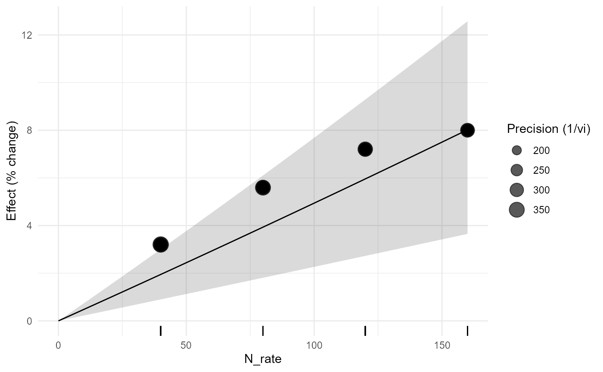
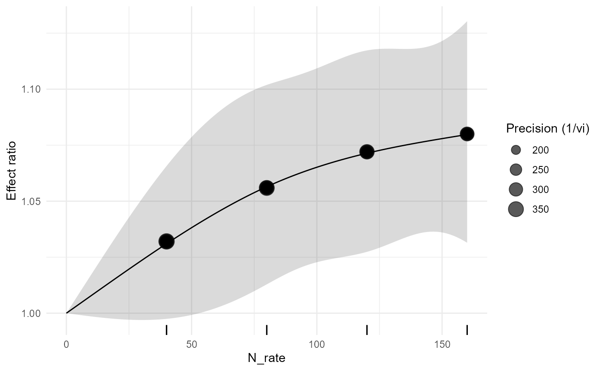
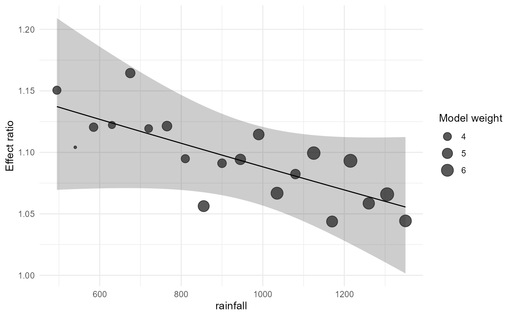
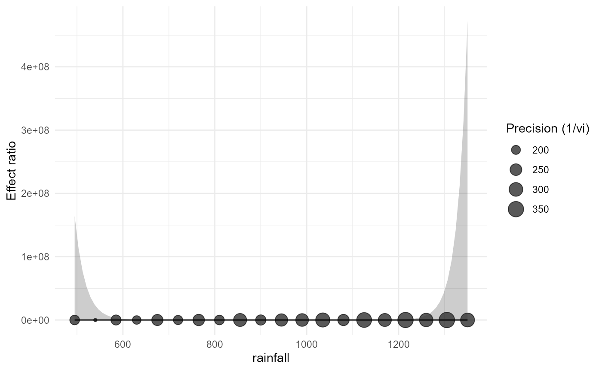
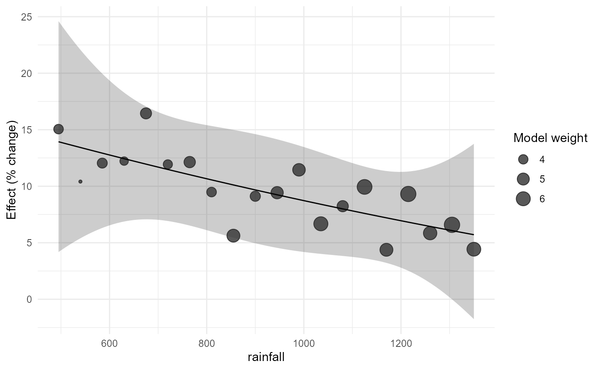

# Version 0.3.0 API Example Reference

## Meta-regression

``` r

m1 <- apm_metareg(irr,~rainfall)
m2 <- apm_metareg(irr,~rainfall+mean_temp)
m3 <- apm_metareg(bio,~crop+site)
```

## Marginal effects

``` r

apm_marginal_effects(m1,at=list(rainfall=c(650,900,1200)))
#> <apm_marginal> weights=equal | transform=auto
#>  rainfall     pred         se ci_lower ci_upper pi_lower pi_upper
#>       650 1.121939 0.02215326 1.070918 1.175391 1.070918 1.175391
#>       900 1.097762 0.01435876 1.065141 1.131382 1.065141 1.131382
#>      1200 1.069436 0.01876787 1.028089 1.112446 1.028089 1.112446
apm_marginal_effects(m2,at=list(rainfall=c(700,1000)))
#> <apm_marginal> weights=equal | transform=auto
#>  rainfall      pred       se     ci_lower    ci_upper     pi_lower    pi_upper
#>       700 0.8324787 4.774116 3.515123e-05 19715.40485 3.515123e-05 19715.40485
#>      1000 1.2056188 1.663132 3.608390e-02    40.28159 3.608390e-02    40.28159
apm_marginal_effects(m3,variables="crop",transform="percent")
#> <apm_marginal> weights=equal | transform=percent
#>         crop     pred         se   ci_lower ci_upper   pi_lower pi_upper
#>  common_bean 6.523174 0.04309177 -2.6969728 16.61699 -2.6969728 16.61699
#>        maize 8.323358 0.01875818  4.1374156 12.67756  4.1374156 12.67756
#>      soybean 6.499606 0.03227482 -0.4824101 13.97147 -0.4824101 13.97147
#>        wheat 4.453785 0.03682445 -3.3226227 12.85570 -3.3226227 12.85570
```

## Interactions

``` r

i1 <- apm_metareg(irr,~rainfall*climate_zone)
i2 <- apm_metareg(bio,~crop*site)
apm_interaction(i1,"rainfall:climate_zone")
#> <apm_interaction> rainfall:climate_zone | contrast=difference
#>                                     label        context      estimate
#>       slope_rainfall | climate_zone=humid rainfall=922.5 -1.288665e-04
#>    slope_rainfall | climate_zone=semiarid rainfall=922.5  1.238407e-05
#>  slope_rainfall | climate_zone=transition rainfall=922.5 -6.213622e-05
#>            se      ci_lower     ci_upper   statistic df distribution   p_value
#>  0.0002451578 -0.0006546776 0.0003969446 -0.52564722 14            t 0.6073594
#>  0.0003714827 -0.0007843670 0.0008091352  0.03333688 14            t 0.9738766
#>  0.0002574490 -0.0006143095 0.0004900370 -0.24135349 14            t 0.8127802
#>  p_adjusted
#>   0.6073594
#>   0.9738766
#>   0.8127802
#> Joint interaction test:
#>   statistic df1 df2 distribution   p_value
#>  0.05299287   2  14            F 0.9485761
apm_interaction(i1,"rainfall:climate_zone",contrast="ratio")
#> <apm_interaction> rainfall:climate_zone | contrast=ratio
#>                                     label        context  estimate           se
#>       slope_rainfall | climate_zone=humid rainfall=922.5 0.9998711 0.0002451578
#>    slope_rainfall | climate_zone=semiarid rainfall=922.5 1.0000124 0.0003714827
#>  slope_rainfall | climate_zone=transition rainfall=922.5 0.9999379 0.0002574490
#>   ci_lower ci_upper   statistic df distribution   p_value p_adjusted
#>  0.9993455 1.000397 -0.52564722 14            t 0.6073594  0.6073594
#>  0.9992159 1.000809  0.03333688 14            t 0.9738766  0.9738766
#>  0.9993859 1.000490 -0.24135349 14            t 0.8127802  0.8127802
#> Joint interaction test:
#>   statistic df1 df2 distribution   p_value
#>  0.05299287   2  14            F 0.9485761
apm_interaction(i2,"crop:site",adjust="holm")
#> <apm_interaction> crop:site | contrast=difference
#>                        label         context     estimate         se   ci_lower
#>    crop=maize vs common_bean      site=Areia  0.029670609 0.08659668 -0.1590073
#>  crop=soybean vs common_bean      site=Areia  0.004038997 0.09985842 -0.2135338
#>    crop=wheat vs common_bean      site=Areia -0.005580770 0.10570655 -0.2358955
#>    crop=maize vs common_bean site=Bananeiras  0.010686439 0.08044875 -0.1645963
#>  crop=soybean vs common_bean site=Bananeiras  0.005674865 0.09288805 -0.1967108
#>    crop=wheat vs common_bean site=Bananeiras -0.030327378 0.09672300 -0.2410687
#>    crop=maize vs common_bean site=Lagoa Seca  0.012011577 0.07773183 -0.1573515
#>  crop=soybean vs common_bean site=Lagoa Seca -0.008615017 0.08797695 -0.2003003
#>    crop=wheat vs common_bean site=Lagoa Seca -0.020755157 0.09315974 -0.2237328
#>   ci_upper   statistic df distribution   p_value p_adjusted
#>  0.2183486  0.34262986 12            t 0.7378038          1
#>  0.2216118  0.04044723 12            t 0.9684017          1
#>  0.2247340 -0.05279493 12            t 0.9587640          1
#>  0.1859692  0.13283538 12            t 0.8965251          1
#>  0.2080605  0.06109360 12            t 0.9522904          1
#>  0.1804139 -0.31354876 12            t 0.7592470          1
#>  0.1813747  0.15452585 12            t 0.8797637          1
#>  0.1830703 -0.09792358 12            t 0.9236096          1
#>  0.1822225 -0.22279106 12            t 0.8274452          1
#> Joint interaction test:
#>   statistic df1 df2 distribution   p_value
#>  0.01625734   6  12            F 0.9999715
```

## Quantitative curves

``` r

c1 <- apm_metareg_curve(irr,rainfall,"linear")
c2 <- apm_metareg_curve(irr,rainfall,"quadratic")
c3 <- apm_metareg_curve(irr,rainfall,"ns",df=3)
```

## Model comparison

``` r

apm_model_compare(m1,m2,criterion="AICc")
#> <apm_model_comparison> criterion=AICc
#>   model  k p   logLik       AIC      AICc       BIC    delta    weight
#>  model1 20 3 36.04221 -66.08443 -64.58443 -63.09723 0.000000 0.8294079
#>  model2 20 4 36.04411 -64.08822 -61.42156 -60.10529 3.162873 0.1705921
apm_model_compare(m1,m2,criterion="AIC")
#> <apm_model_comparison> criterion=AIC
#>   model  k p   logLik       AIC      AICc       BIC    delta    weight
#>  model1 20 3 36.04221 -66.08443 -64.58443 -63.09723 0.000000 0.7306855
#>  model2 20 4 36.04411 -64.08822 -61.42156 -60.10529 1.996206 0.2693145
apm_model_compare(m1,m2,criterion="BIC")
#> <apm_model_comparison> criterion=BIC
#>   model  k p   logLik       AIC      AICc       BIC    delta    weight
#>  model1 20 3 36.04221 -66.08443 -64.58443 -63.09723 0.000000 0.8169725
#>  model2 20 4 36.04411 -64.08822 -61.42156 -60.10529 2.991939 0.1830275
```

## Context prediction

``` r

apm_predict_context(m1,data.frame(rainfall=700))
#> <apm_prediction> transform=auto
#>  rainfall       support     pred         se ci_lower ci_upper pi_lower pi_upper
#>       700 interpolation 1.117061 0.02010718 1.070855 1.165261 1.070855 1.165261
#>  threshold_relation probability_above_threshold probability_basis
#>                <NA>                          NA     not requested
apm_predict_context(m2,data.frame(rainfall=900,mean_temp=25),transform="percent")
#> <apm_prediction> transform=percent
#>  rainfall mean_temp       support     pred        se  ci_lower ci_upper
#>       900        25 interpolation 10.50814 0.1088469 -12.16656 39.03644
#>   pi_lower pi_upper threshold_relation probability_above_threshold
#>  -12.16656 39.03644               <NA>                          NA
#>  probability_basis
#>      not requested
apm_predict_context(c2,data.frame(rainfall=c(700,1000)),threshold=5,transform="percent")
#> <apm_prediction> transform=percent
#>  rainfall       support      pred         se ci_lower ci_upper pi_lower
#>       700 interpolation 11.691871 0.02021389 7.028627 16.55829 7.028627
#>      1000 interpolation  8.726033 0.02023404 4.182187 13.46806 4.182187
#>  pi_upper threshold_relation probability_above_threshold
#>  16.55829              above                   0.9988803
#>  13.46806           overlaps                   0.9575900
#>                                    probability_basis
#>  normal approximation on the prediction distribution
#>  normal approximation on the prediction distribution
```

## Curve features

``` r

apm_curve_features(c2,"slope")
#> <apm_curve_features>
#> Slope grid: 200 locations
#> Moderator-curve features are descriptive across-study associations and are not automatically causal dose recommendations.
apm_curve_features(c2,c("slope","turning_point"))
#> <apm_curve_features>
#> Turning points:
#> [1] location        lower           upper           inside_support 
#> [5] interval_method
#> <0 rows> (or 0-length row.names)
#> Slope grid: 200 locations
#> Moderator-curve features are descriptive across-study associations and are not automatically causal dose recommendations.
apm_curve_features(c3,"threshold_crossing",threshold=log(1.05))
#> <apm_curve_features>
#> Threshold crossings:
#> [1] location        lower           upper           threshold      
#> [5] inside_support  interval_method
#> <0 rows> (or 0-length row.names)
#> Moderator-curve features are descriptive across-study associations and are not automatically causal dose recommendations.
```

## Dose-response

``` r

d1 <- apm_dose_response(fertilizer_dose_response,effect=lnRR,dose=N_rate,study=study_id,form="linear",method="fixed")
d2 <- apm_dose_response(fertilizer_dose_response,effect=lnRR,dose=N_rate,study=study_id,form="quadratic",method="fixed")
d3 <- apm_dose_response(fertilizer_dose_response,effect=lnRR,dose=N_rate,study=study_id,form="ns",df=3,method="fixed")
```

## Dose plots

``` r

apm_dose_plot(d1,transform="percent")
```



``` r

apm_dose_plot(d2,prediction=TRUE)
```


``` r

apm_dose_plot(d3,rug=TRUE)
```



## Bubble plots

``` r

apm_bubble(m1,rainfall)
```



``` r

apm_bubble(m2,rainfall,size="precision")
```



``` r

apm_bubble(c2,rainfall,transform="percent")
```


