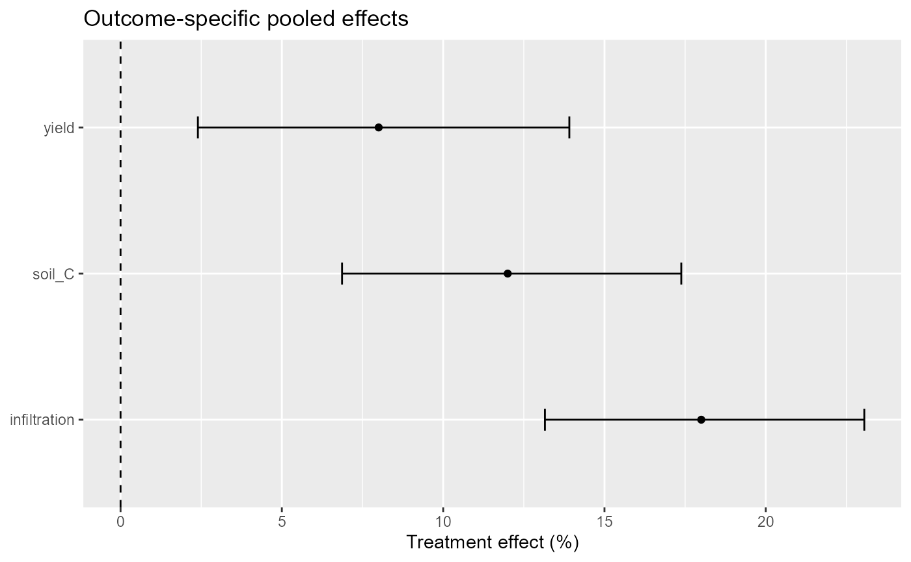
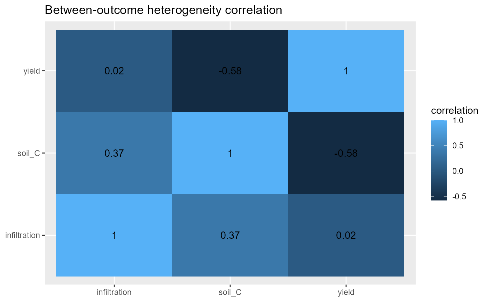
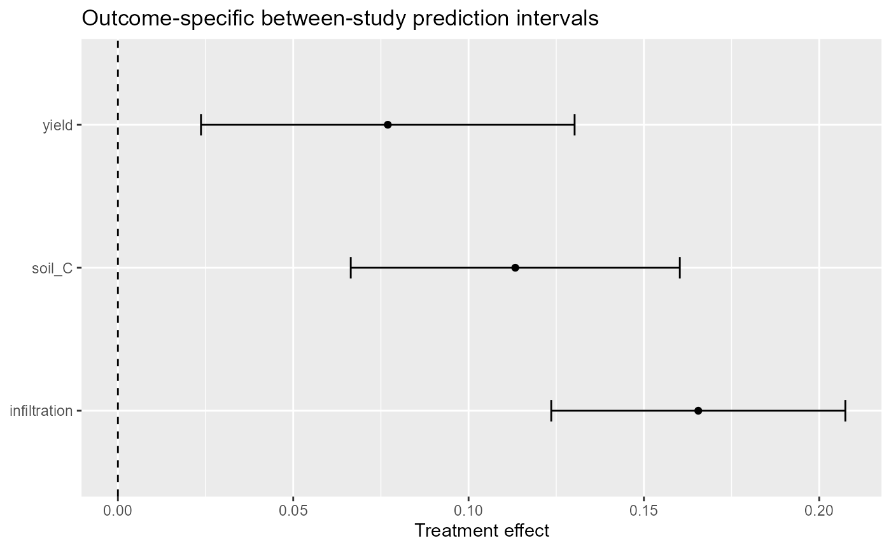

# Multivariate treatment-control meta-analysis in agronomy

## Why multivariate synthesis matters

Agronomic experiments rarely measure only one endpoint. A
soil-management study may report yield, soil organic carbon,
infiltration, nutrient-use efficiency, and greenhouse-gas emissions from
the same experimental units. Separate univariate meta-analyses are
useful for endpoint-specific questions, but they discard the correlation
created by measuring several responses in the same study and cannot
estimate a between-outcome heterogeneity covariance structure.

`agriPairMetaFlow` therefore treats multivariate synthesis as a distinct
estimand and data problem. A study identifier must identify the
independent experimental unit contributing the response vector. The
`outcome` variable identifies endpoints, while `yi` and `vi` remain the
effect estimate and its sampling variance on a coherent scale.

## Teaching data

`soil_management_multiresponse` contains three outcomes per synthetic
experiment. The response-ratio effects are already available as `yi`;
the package deliberately labels the data as synthetic teaching data
rather than field evidence.

``` r

head(soil_management_multiresponse)
#>   study_id      outcome    treatment      control mean_t  sd_t n_t mean_c  sd_c
#> 1     SM01       soil_C conservation conventional 18.547 1.573   5 16.560 1.656
#> 2     SM02 infiltration conservation conventional 27.730 2.232   6 23.500 2.350
#> 3     SM03        yield conservation conventional  4.355 0.383   4  4.032 0.403
#> 4     SM04       soil_C conservation conventional 19.757 1.676   5 17.640 1.764
#> 5     SM05 infiltration conservation conventional 26.550 2.137   6 22.500 2.250
#> 6     SM06        yield conservation conventional  4.173 0.367   4  3.864 0.386
#>   n_c         effect_id mv_study_id climate_zone       lnRR         yi
#> 1   5       SM01_soil_C       SMV01     semiarid 0.11331790 0.11331790
#> 2   6 SM02_infiltration       SMV01     semiarid 0.16551444 0.16551444
#> 3   4        SM03_yield       SMV01     semiarid 0.07706208 0.07706208
#> 4   5       SM04_soil_C       SMV02   transition 0.11333881 0.11333881
#> 5   6 SM05_infiltration       SMV02   transition 0.16551444 0.16551444
#> 6   4        SM06_yield       SMV02   transition 0.07693229 0.07693229
#>            vi        sei measure
#> 1 0.003438600 0.05863958     ROM
#> 2 0.002746452 0.05240660     ROM
#> 3 0.004431096 0.06656648     ROM
#> 4 0.003439249 0.05864511     ROM
#> 5 0.002746430 0.05240640     ROM
#> 6 0.004428466 0.06654672     ROM
with(soil_management_multiresponse, table(mv_study_id, outcome))
#>            outcome
#> mv_study_id infiltration soil_C yield
#>       SMV01            1      1     1
#>       SMV02            1      1     1
#>       SMV03            1      1     1
#>       SMV04            1      1     1
#>       SMV05            1      1     1
#>       SMV06            1      1     1
```

The second example, `biochar_multiresponse`, contains yield, soil
carbon, and N2O responses from eight synthetic studies.

``` r

head(biochar_multiresponse)
#>   study_id outcome climate_zone treatment    control  mean_t   sd_t n_t mean_c
#> 1     BC01   yield     semiarid   biochar no_biochar  4.0090 0.3849   5   3.80
#> 2     BC01  soil_C     semiarid   biochar no_biochar 16.2400 1.4031   5  14.50
#> 3     BC01     N2O     semiarid   biochar no_biochar  1.9800 0.2661   5   2.20
#> 4     BC02   yield   transition   biochar no_biochar  4.2307 0.4062   6   3.98
#> 5     BC02  soil_C   transition   biochar no_biochar 17.2064 1.4866   6  15.20
#> 6     BC02     N2O   transition   biochar no_biochar  2.0292 0.2727   6   2.28
#>     sd_c n_c   effect_id        lnRR          vi        sei measure          yi
#> 1 0.3800   5  BC01_yield  0.05354077 0.003843200 0.06199355     ROM  0.05354077
#> 2 1.3050   5 BC01_soil_C  0.11332869 0.003112992 0.05579419     ROM  0.11332869
#> 3 0.3080   5    BC01_N2O -0.10536052 0.007532672 0.08679097     ROM -0.10536052
#> 4 0.3980   6  BC02_yield  0.06109510 0.003202667 0.05659211     ROM  0.06109510
#> 5 1.3680   6 BC02_soil_C  0.12398598 0.002594160 0.05093290     ROM  0.12398598
#> 6 0.3192   6    BC02_N2O -0.11653382 0.006277227 0.07922895     ROM -0.11653382
with(biochar_multiresponse, table(study_id, outcome))
#>         outcome
#> study_id N2O soil_C yield
#>     BC01   1      1     1
#>     BC02   1      1     1
#>     BC03   1      1     1
#>     BC04   1      1     1
#>     BC05   1      1     1
#>     BC06   1      1     1
#>     BC07   1      1     1
#>     BC08   1      1     1
```

## Start with the sampling covariance

If the within-study covariance between outcomes is known or can be
reconstructed, it should be supplied. The simplest diagonal matrix
assumes zero within-study outcome correlation and is useful as a
baseline, not as a default scientific conclusion.

``` r

V0 <- diag(soil_management_multiresponse$vi)
mv0 <- apm_multivariate(
  soil_management_multiresponse,
  outcome = outcome,
  study = mv_study_id,
  V = V0,
  structure = "UN"
)
mv0
#> <apm_multivariate> outcomes=3 | backend=metafor | structure=UN
#>       outcome   estimate         se   ci_lower  ci_upper
#>        soil_C 0.11332670 0.02394046 0.06640427 0.1602491
#>  infiltration 0.16551444 0.02139614 0.12357878 0.2074501
#>         yield 0.07696938 0.02718237 0.02369290 0.1302458
#>                           context          tau   pi_lower  pi_upper
#>  reference/zero moderator context 1.511808e-07 0.06640427 0.1602491
#>  reference/zero moderator context 1.498374e-07 0.12357878 0.2074501
#>  reference/zero moderator context 6.450400e-07 0.02369290 0.1302458
#> Between-outcome correlation matrix available.
summary(mv0)
#> <summary.apm_multivariate> backend=metafor | structure=UN
#>       outcome   estimate         se   ci_lower  ci_upper
#>        soil_C 0.11332670 0.02394046 0.06640427 0.1602491
#>  infiltration 0.16551444 0.02139614 0.12357878 0.2074501
#>         yield 0.07696938 0.02718237 0.02369290 0.1302458
#>                           context          tau   pi_lower  pi_upper
#>  reference/zero moderator context 1.511808e-07 0.06640427 0.1602491
#>  reference/zero moderator context 1.498374e-07 0.12357878 0.2074501
#>  reference/zero moderator context 6.450400e-07 0.02369290 0.1302458
#> Between-outcome correlation:
#>                  soil_C infiltration       yield
#> soil_C        1.0000000   0.36743510 -0.58010885
#> infiltration  0.3674351   1.00000000  0.02283455
#> yield        -0.5801088   0.02283455  1.00000000
```

An unstructured between-outcome covariance is flexible but parameter
intensive. A compound-symmetry or diagonal structure can be evaluated
when scientifically justified.

``` r

mv_cs <- apm_multivariate(
  soil_management_multiresponse,
  outcome = outcome,
  study = mv_study_id,
  V = V0,
  structure = "CS"
)
mv_diag <- apm_multivariate(
  soil_management_multiresponse,
  outcome = outcome,
  study = mv_study_id,
  V = V0,
  structure = "DIAG"
)
```

## Moderators in a multivariate model

Moderators are expanded by outcome. This allows the treatment-control
effect to vary with climate while retaining outcome-specific intercepts.

``` r

mv_climate <- apm_multivariate(
  soil_management_multiresponse,
  outcome = outcome,
  study = mv_study_id,
  V = V0,
  mods = ~ climate_zone,
  structure = "UN"
)
```

The modifier should be prespecified and interpreted as an association in
the meta-regression. It is not automatically a causal effect of climate.

## Unknown within-study correlations

Published agronomic papers often report marginal standard errors but
omit cross-outcome covariances. A single guessed correlation should not
be hidden inside the analysis.
[`apm_mvcor_sensitivity()`](https://wep69.github.io/agriPairMetaFlow/reference/apm_mvcor_sensitivity.md)
reconstructs block covariance matrices over a prespecified correlation
grid and refits the same multivariate model.

``` r

sens1 <- apm_mvcor_sensitivity(
  soil_management_multiresponse,
  outcome = outcome,
  study = mv_study_id,
  rho = c(0, .25, .50, .75)
)
sens1
#> <apm_sensitivity>
#>   rho      outcome   estimate         se          tau
#>  0.00       soil_C 0.11332670 0.02394046 1.511841e-07
#>  0.00 infiltration 0.16551444 0.02139614 1.498349e-07
#>  0.00        yield 0.07696938 0.02718237 6.450308e-07
#>  0.25       soil_C 0.11332670 0.02394046 4.904135e-08
#>  0.25 infiltration 0.16551444 0.02139613 7.454493e-08
#>  0.25        yield 0.07696938 0.02718237 2.000015e-07
#>  0.50       soil_C 0.11332671 0.02394046 1.134472e-07
#>  0.50 infiltration 0.16551444 0.02139613 1.039788e-07
#>  0.50        yield 0.07696938 0.02718237 1.813707e-07
#>  0.75       soil_C 0.11332672 0.02394046 1.120506e-07
#>  0.75 infiltration 0.16551445 0.02139613 4.058872e-08
#>  0.75        yield 0.07696939 0.02718237 1.251009e-07
```

The same sensitivity workflow can be used for the biochar example.

``` r

sens2 <- apm_mvcor_sensitivity(
  biochar_multiresponse,
  outcome = outcome,
  study = study_id,
  rho = seq(0, .8, by=.2),
  metric = "tau"
)
```

A moderator can be retained across the entire sensitivity grid.

``` r

sens3 <- apm_mvcor_sensitivity(
  soil_management_multiresponse,
  outcome = outcome,
  study = mv_study_id,
  rho = c(0, .3, .6),
  fit_args = list(mods = ~ climate_zone)
)
```

The scientific question is not which value of rho gives the most
convenient result. The question is whether the substantive conclusion
changes across a plausible set of correlations.

## Visualization

The outcome forest emphasizes endpoint-specific pooled effects.

``` r

apm_multivariate_plot(mv0, type="outcome_forest", transform="percent")
#> `height` was translated to `width`.
```



When a between-outcome correlation matrix is estimable, its structure
can be inspected directly.

``` r

if (!is.null(mv0$between_cor)) {
  apm_multivariate_plot(mv0, type="correlation")
}
```



A third presentation is available for the outcome summary on the model
scale.

``` r

apm_multivariate_plot(mv0, type="prediction", transform="none")
#> `height` was translated to `width`.
```



## Backend cross-check

The default multivariate backend is
[`metafor::rma.mv()`](https://wviechtb.github.io/metafor/reference/rma.mv.html).
`mixmeta` is optional and useful as an independent implementation and
for alternative multivariate structures. The 0.4.0 adapter requires a
complete outcome profile for every study when `backend="mixmeta"`.

``` r

mv_mix <- apm_multivariate(
  biochar_multiresponse,
  outcome = outcome,
  study = study_id,
  V = diag(biochar_multiresponse$vi),
  structure = "CS",
  backend = "mixmeta"
)
```

During local validation, estimates and covariance matrices should be
compared directly with independently specified `metafor` and `mixmeta`
fits. Agreement is a numerical validation gate, not merely a
documentation example.

## Interpretation checklist

A multivariate result should state the effect scale, the independent
study unit, the origin of the sampling covariance matrix, the assumed or
estimated correlation structure, the between-outcome heterogeneity
structure, the number of studies and outcome profiles, and the
sensitivity of conclusions to unknown correlations. Missing covariance
information should never be described as if it were observed.
