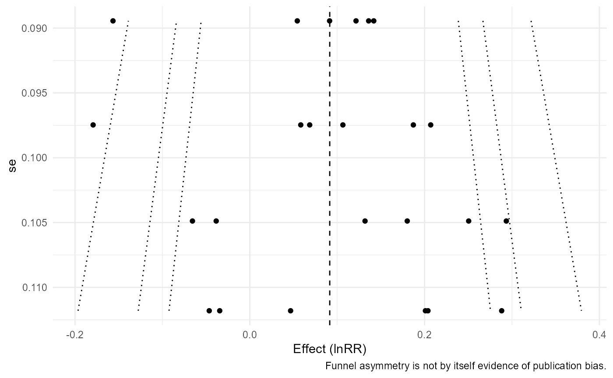
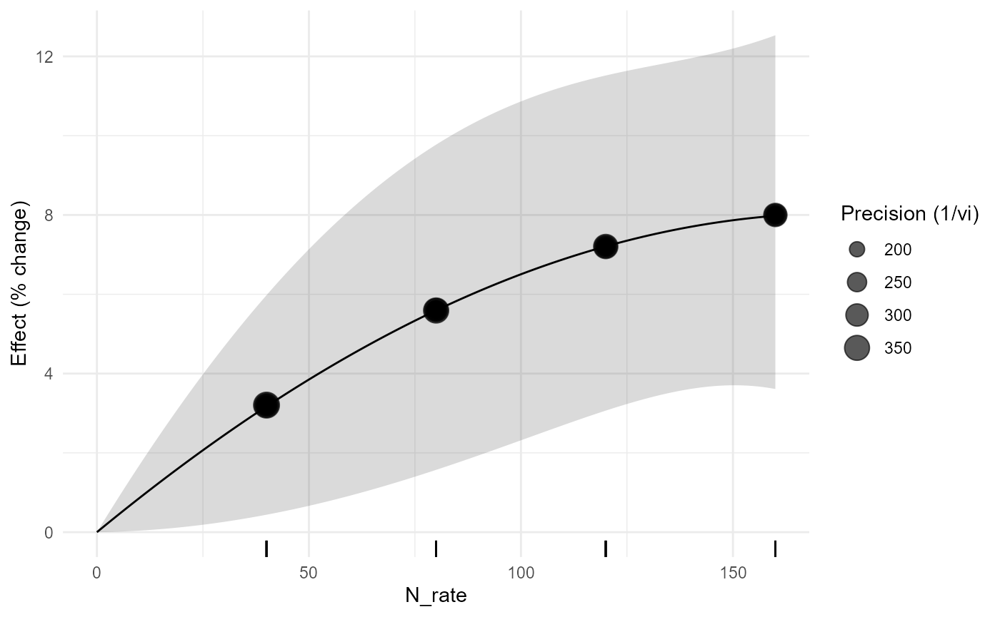
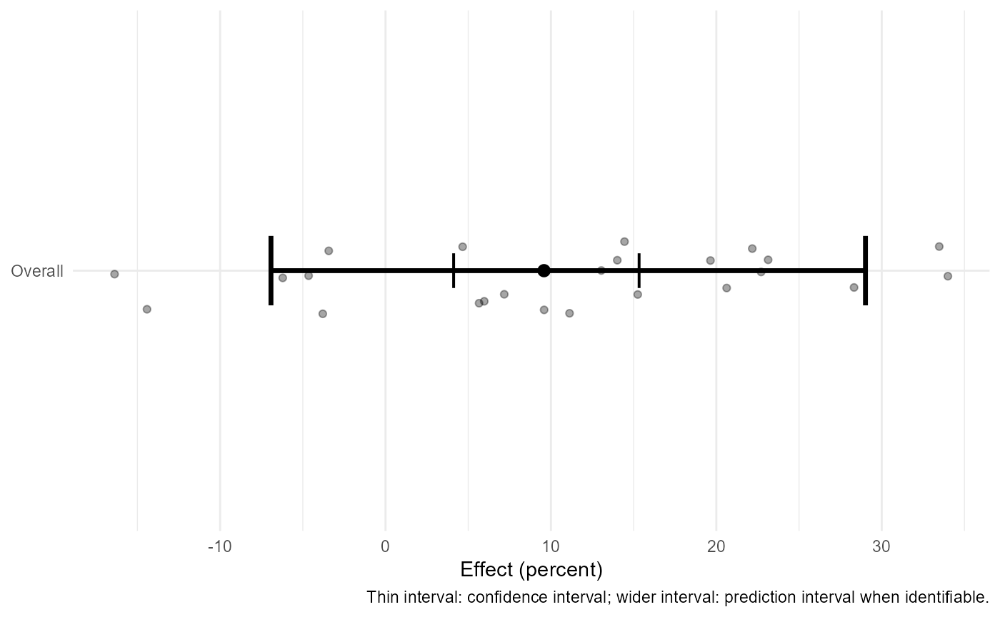

# agriPairMetaFlow 0.3.0: From Agronomic Question to Dependence-aware Meta-regression and Dose Response

## 1. Why the package starts with design

A treatment-control meta-analysis is not defined only by two columns of
means. The experimental unit, reused controls, true matching, response
scale, and uncertainty determine what can be synthesized. Version 0.3.0
connects auditing, effect-size construction, dependence-aware fitting,
robust inference, prespecified meta-regression, quantitative moderator
curves, and correlated dose-response synthesis.

## 2. Inspect and audit

``` r

apm_validate(maize_n_shared, "summary", strict=FALSE)
#> <apm_validation> PASS
apm_audit(maize_n_shared, "full")
#> <apm_audit>
#>  severity           code
#>   warning shared_control
#>                                                                            message
#>  8 study/experiment control arm(s) are reused across multiple treatment contrasts.
#>  rows
#>  <NA>
#>                                                                                               action
#>  Model sampling dependence in version 0.2.0 or use one independent contrast per experiment in 0.1.0.
apm_plan(maize_n_shared, study=study_id, experiment=experiment_id, treatment=treatment, control=control, response=mean_t, dose=N_rate)
#> <apm_plan>
#> design: independent 
#> shared controls: 8 
#> - Shared controls detected: version 0.1.0 can audit them, but covariance modeling is introduced in 0.2.0.
```

The audit warns that the same control is reused. This is scientifically
consequential. From version 0.2.0 onward the covariance can be
represented explicitly with
[`apm_vcov()`](https://wep69.github.io/agriPairMetaFlow/reference/apm_vcov.md)
and fitted with multilevel or meta-regression models rather than
treating these contrasts as independent.

## 3. Effect sizes

``` r

e_rr <- apm_effect_size(covercrop_variability,"lnRR",m_t=mean_t,sd_t=sd_t,n_t=n_t,m_c=mean_c,sd_c=sd_c,n_c=n_c)
e_vr <- apm_effect_size(covercrop_variability,"VR",m_t=mean_t,sd_t=sd_t,n_t=n_t,m_c=mean_c,sd_c=sd_c,n_c=n_c)
e_cvr <- apm_effect_size(covercrop_variability,"CVR",m_t=mean_t,sd_t=sd_t,n_t=n_t,m_c=mean_c,sd_c=sd_c,n_c=n_c)
```

lnRR addresses mean response; VR and CVR ask different questions about
variability. A treatment may increase the expected yield yet decrease
relative variability, which can be agronomically valuable.

## 4. Core model, heterogeneity, prediction, and thresholds

``` r

fit <- apm_fit(agri_effects_benchmark)
apm_heterogeneity(fit, ci=FALSE)
#> <apm_heterogeneity>
#>   k        Q Q_df        Q_p        tau2        tau       I2       H2
#>  24 37.47688   23 0.02896215 0.006258635 0.07911153 38.53446 1.626928
apm_prediction(fit, transform="percent")
#> <apm_prediction> transform=percent
#>      pred         se ci_lower ci_upper  pi_lower pi_upper
#>  9.581184 0.02609049 4.118456 15.33052 -6.925962 29.01595
apm_threshold(fit, 5, scale="percent")
#> <apm_threshold>
#> threshold: 5 [ percent ]
#> CI: crosses threshold 
#> PI: crosses threshold 
#> probability: 0.696
```

A confidence interval describes uncertainty about the average effect. A
prediction interval addresses the range expected for a future context
under the fitted random-effects model. They answer different questions
and should not be interchanged.

## 5. Subgroups and visualization

``` r

apm_subgroup(agri_effects_benchmark, crop, test="z")
#> <apm_subgroup>
#>  subgroup k   estimate         se    ci_lower  ci_upper   pi_lower  pi_upper
#>     maize 8 0.08643770 0.05243914 -0.01634113 0.1892165 -0.1505993 0.3234746
#>   soybean 8 0.08415367 0.03530365  0.01495980 0.1533475  0.0149598 0.1533475
#>     wheat 8 0.10958704 0.05273047  0.00623722 0.2129369 -0.1296627 0.3488368
#> Omnibus subgroup test:
#>         QM df       QMp
#>  0.1950858  2 0.9070634
apm_forest(fit, transform="percent", columns=c("crop","dose"))
#> `height` was translated to `width`.
```


``` r

apm_funnel(fit, contour=TRUE)
```



``` r

apm_table(fit,"model",transform="percent")
#>            term estimate    se ci_lower ci_upper
#> intrcpt intrcpt    9.581 0.026    4.118   15.331
```

A funnel plot is a diagnostic display, not a publication-bias verdict.
Subgroup-specific significance is likewise not evidence that subgroup
effects differ; the between-subgroup test is the relevant comparison.

## 6. Dependence-aware meta-regression

``` r

mz_es <- apm_effect_size(maize_n_shared,"lnRR",m_t=mean_t,sd_t=sd_t,n_t=n_t,m_c=mean_c,sd_c=sd_c,n_c=n_c)
mz_V <- apm_vcov(mz_es,cluster=experiment_id,shared_control=TRUE)
mz_reg <- apm_metareg(mz_es,~N_rate+soil_texture,V=mz_V,random=~1|study_id/effect_id)
apm_marginal_effects(mz_reg,variables="soil_texture",transform="percent")
#> <apm_marginal> weights=equal | transform=percent
#>  soil_texture     pred         se ci_lower ci_upper pi_lower pi_upper
#>          clay 9.407854 0.03134488 2.483151 16.80045       NA       NA
#>          loam 9.247484 0.02928991 2.772532 16.13038       NA       NA
#>         sandy 9.836766 0.03578598 1.936194 18.34967       NA       NA
```

The moderator analysis retains the sampling covariance induced by the
common zero-N arm.

## 7. Quantitative moderator curves

``` r

irr_es <- apm_effect_size(irrigation_climate,"lnRR",m_t=mean_t,sd_t=sd_t,n_t=n_t,m_c=mean_c,sd_c=sd_c,n_c=n_c)
irr_curve <- apm_metareg_curve(irr_es,rainfall,"quadratic")
apm_curve_features(irr_curve,c("slope","turning_point"))
#> <apm_curve_features>
#> Turning points:
#> [1] location        lower           upper           inside_support 
#> [5] interval_method
#> <0 rows> (or 0-length row.names)
#> Slope grid: 200 locations
#> Moderator-curve features are descriptive across-study associations and are not automatically causal dose recommendations.
apm_predict_context(irr_curve,data.frame(rainfall=c(700,1000)),transform="percent")
#> <apm_prediction> transform=percent
#>  rainfall       support      pred         se ci_lower ci_upper pi_lower
#>       700 interpolation 11.691871 0.02021389 7.028627 16.55829 7.028627
#>      1000 interpolation  8.726033 0.02023404 4.182187 13.46806 4.182187
#>  pi_upper threshold_relation probability_above_threshold probability_basis
#>  16.55829               <NA>                          NA     not requested
#>  13.46806               <NA>                          NA     not requested
```

These are across-study moderator relationships. A curve feature is not
automatically a causal agronomic optimum.

## 8. Correlated dose-response

``` r

dose_fit <- apm_dose_response(fertilizer_dose_response,effect=lnRR,dose=N_rate,study=study_id,form="quadratic",method="fixed")
apm_dose_plot(dose_fit,transform="percent")
```



Dose-response is kept conceptually separate because several doses within
one experiment share the same reference group.

## Version 0.5.0: diagnosing, stress-testing, and communicating the synthesis

A fitted model is not the end of the workflow. Before communicating an
agronomic synthesis, ask whether the conclusion is unusually dependent
on one independent study, whether subsets reveal unresolved
heterogeneity structure, whether small-study patterns change under
explicit selection assumptions, and whether the final figure
distinguishes mean-effect uncertainty from prediction for a new setting.

``` r

fit05 <- apm_fit(agri_effects_benchmark)
loo05 <- apm_leave_one_out(fit05, unit = "study")
inf05 <- apm_influence(fit05, unit = "study", plot = FALSE)
bias05 <- apm_bias(fit05, methods = c("egger", "rank", "trimfill"))
apm_orchard(fit05, transform = "percent")
#> `height` was translated to `width`.
#> `height` was translated to `width`.
```



``` r

apm_explain(fit05, audience = "scientific", transform = "percent")
#> [1] "The pooled meta-analytic estimate is 9.6% with an approximate 95% interval from 4.1% to 15.3%. This interval describes uncertainty in the estimated mean effect, not the range expected in every future agronomic setting."
#> [2] "The 95% prediction interval for a new true study effect extends from -6.9% to 29.0%. A wide interval indicates that response can differ materially among environments, years, crops, soils, or management contexts."       
#> [3] "Interpretation assumes the effect-size calculation, experimental-unit definition, sampling variances, dependence structure, and fitted heterogeneity model are appropriate for the included evidence."                     
#> [4] "Statistical significance alone is not treated as agronomic importance. Use prediction intervals, practical thresholds, dependence diagnostics, and sensitivity analyses where relevant."                                   
#> attr(,"tags")
#> attr(,"tags")$object_class
#> [1] "apm_model"
#> 
#> attr(,"tags")$audience
#> [1] "scientific"
#> 
#> attr(,"tags")$estimate
#> [1] 0.0914955
#> 
#> attr(,"tags")$ci
#> [1] 0.04035907 0.14263192
#> 
#> attr(,"tags")$prediction_interval
#> [1] -0.0717749  0.2547659
#> 
#> attr(,"tags")$measure
#> [1] "lnRR"
#> 
#> attr(,"class")
#> [1] "apm_explanation" "character"
```

These functions answer different questions. Leave-one-study-out
sensitivity asks whether the pooled result or heterogeneity depends
strongly on one independent evidence unit. Influence metrics locate
unusual leverage or impact. GOSH examines many subsets and is useful for
discovering unresolved structures. Funnel-asymmetry and selection
analyses probe possible small-study or publication-selection mechanisms
under specific assumptions. None of these procedures provides an
automatic study-exclusion rule.

When many moderators are available,
[`apm_moderator_screen()`](https://wep69.github.io/agriPairMetaFlow/reference/apm_moderator_screen.md)
can be used as an exploratory MetaForest stage. It should be followed by
scientifically specified meta-regression rather than interpreted as a
confirmatory variable-selection procedure. The package keeps this
distinction in the returned class and caution text.

For reporting,
[`apm_report()`](https://wep69.github.io/agriPairMetaFlow/reference/apm_report.md)
summarizes an already fitted object and records provenance; it does not
refit the model.
[`apm_export()`](https://wep69.github.io/agriPairMetaFlow/reference/apm_export.md)
preserves the complete object in RDS or creates numeric tables and
publication-quality figures. Large GOSH, MetaForest tuning, wild
bootstrap, and Bayesian computation should be precomputed in the
developer workflow when they would make routine vignette rendering
expensive.
