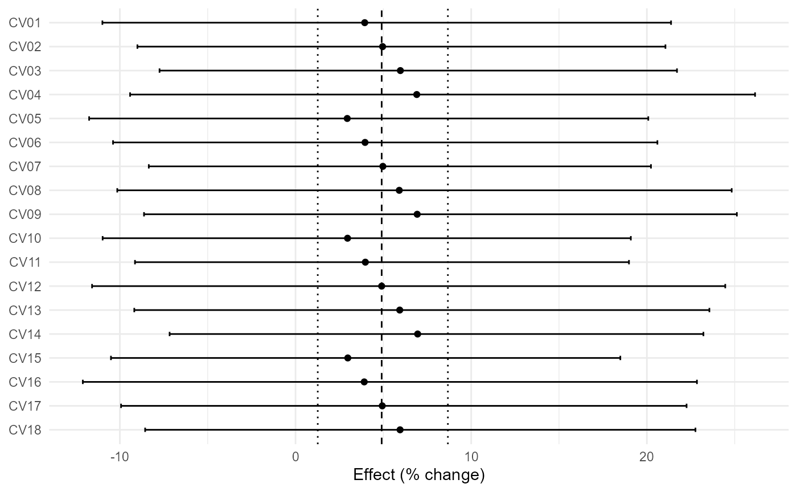
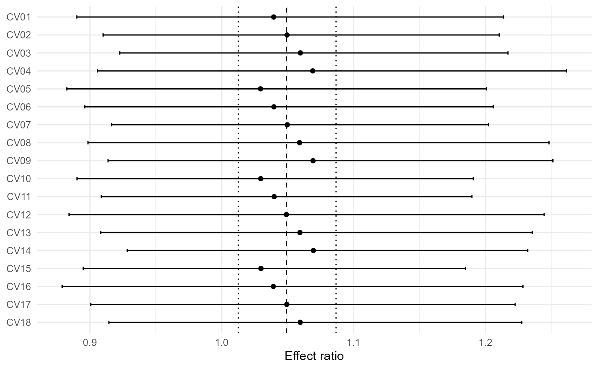
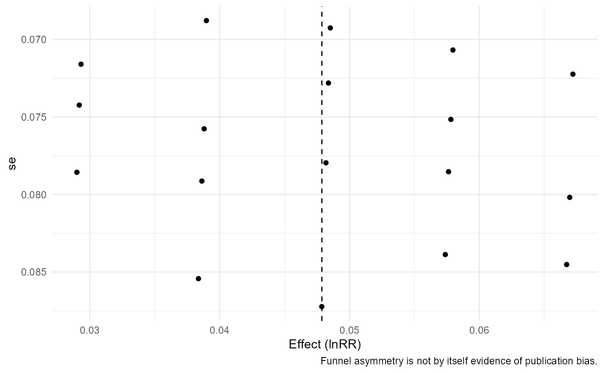
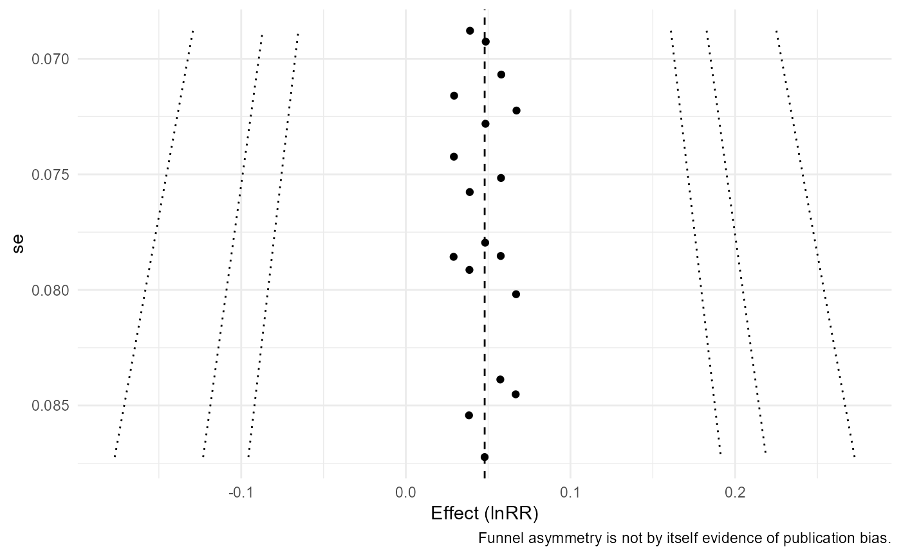
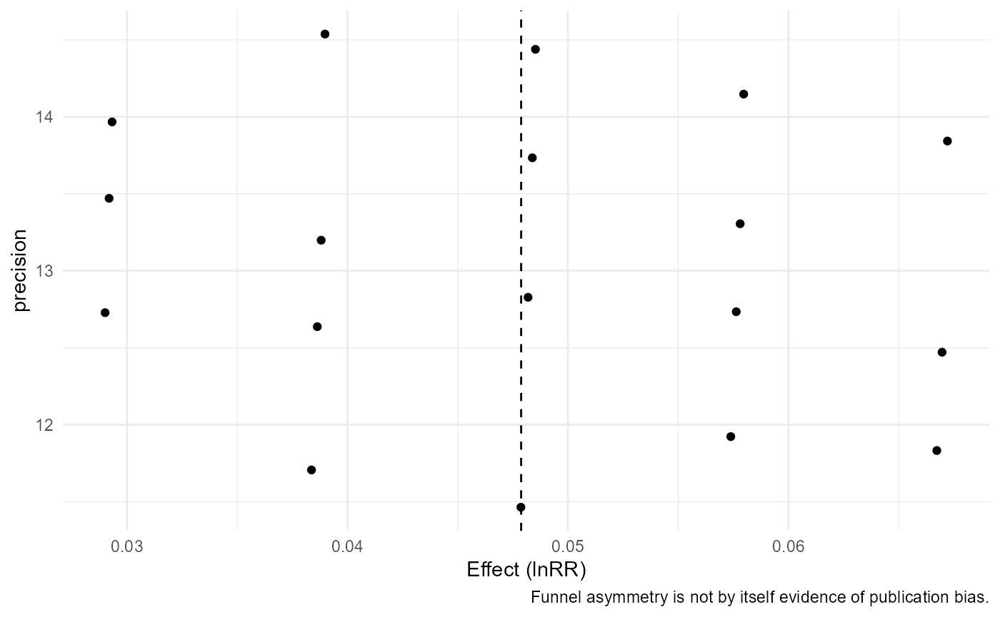

# API Example Reference for agriPairMetaFlow 0.1.0

This vignette is a compact executable reference used to guarantee broad
example coverage without replacing the conceptual tutorials.

``` r

f <- system.file("extdata","maize_n_shared.csv",package="agriPairMetaFlow")
if(nzchar(f)){apm_read(f);apm_read(f,mapping=c(study="study_id"));apm_read(f,units=c(mean_t="Mg ha-1"))}
#> <apm_data>
#> 24 rows x 15 columns
#> source: C:/Users/wep69/AppData/Local/Temp/opencode/RLib_fixed/agriPairMetaFlow/extdata/maize_n_shared.csv
apm_validate(maize_n_shared,"summary",strict=FALSE);apm_validate(pest_suppression_binary,"binary",strict=FALSE);apm_validate(agri_effects_benchmark,"effect",strict=FALSE)
#> <apm_validation> PASS
#> <apm_validation> PASS
#> <apm_validation> PASS
apm_audit(maize_n_shared);apm_audit(agri_uncertainty_mixed,"full");apm_audit(soil_management_multiresponse)
#> <apm_audit>
#>  severity           code
#>   warning shared_control
#>                                                                            message
#>  8 study/experiment control arm(s) are reused across multiple treatment contrasts.
#>  rows
#>  <NA>
#>                                                                                     action
#>  Model sampling dependence with apm_vcov() or use one independent contrast per experiment.
#> <apm_audit>
#> No audit issues detected.
#> <apm_audit>
#> No audit issues detected.
apm_plan(maize_n_shared,study_id,treatment,control,response=mean_t);apm_plan(wheat_paired_blocks,study_id,treatment,control,response=mean_t,block=block_id,design="paired");apm_plan(bioinoculant_multicrop,study_id,treatment,control,response=mean_t)
#> <apm_plan>
#> design: independent 
#> shared controls: 8 
#> - Shared controls detected: model their sampling covariance with apm_vcov().
#> <apm_plan>
#> design: paired 
#> shared controls: 0
#> <apm_plan>
#> design: independent 
#> shared controls: 0
apm_recover_uncertainty(agri_uncertainty_mixed,mean_yield,n,se=se_yield,method="se");apm_recover_uncertainty(agri_uncertainty_mixed,mean_yield,n,cv=cv_percent,method="cv");apm_recover_uncertainty(agri_uncertainty_mixed,mean_yield,n,mse=residual_mse,method="mse")
#> <apm_uncertainty>
#> 
#> derived_from_se            <NA> 
#>               4               8
#> <apm_uncertainty>
#> 
#> derived_from_cv            <NA> 
#>               4               8
#> <apm_uncertainty>
#> 
#> derived_from_mse             <NA> 
#>                4                8
e1<-apm_effect_size(covercrop_variability,"lnRR",m_t=mean_t,sd_t=sd_t,n_t=n_t,m_c=mean_c,sd_c=sd_c,n_c=n_c);e2<-apm_effect_size(covercrop_variability,"VR",m_t=mean_t,sd_t=sd_t,n_t=n_t,m_c=mean_c,sd_c=sd_c,n_c=n_c);e3<-apm_effect_size(covercrop_variability,"CVR",m_t=mean_t,sd_t=sd_t,n_t=n_t,m_c=mean_c,sd_c=sd_c,n_c=n_c)
m1<-apm_fit(e1);m2<-apm_fit(e2,test="knha");m3<-apm_fit(agri_effects_benchmark,model="common")
apm_subgroup(agri_effects_benchmark,crop,test="z");apm_subgroup(agri_effects_benchmark,soil_texture,test="z");apm_subgroup(agri_effects_benchmark,cut(rainfall,3),test="z")
#> <apm_subgroup>
#>  subgroup k   estimate         se    ci_lower  ci_upper   pi_lower  pi_upper
#>     maize 8 0.08643770 0.05243914 -0.01634113 0.1892165 -0.1505993 0.3234746
#>   soybean 8 0.08415367 0.03530365  0.01495980 0.1533475  0.0149598 0.1533475
#>     wheat 8 0.10958704 0.05273047  0.00623722 0.2129369 -0.1296627 0.3488368
#> Omnibus subgroup test:
#>         QM df       QMp
#>  0.1950858  2 0.9070634
#> <apm_subgroup>
#>  subgroup k   estimate         se    ci_lower  ci_upper   pi_lower  pi_upper
#>      clay 8 0.10958704 0.05273047  0.00623722 0.2129369 -0.1296627 0.3488368
#>      loam 8 0.08415367 0.03530365  0.01495980 0.1533475  0.0149598 0.1533475
#>     sandy 8 0.08643770 0.05243914 -0.01634113 0.1892165 -0.1505993 0.3234746
#> Omnibus subgroup test:
#>         QM df       QMp
#>  0.1950858  2 0.9070634
#> <apm_subgroup>
#>             subgroup k    estimate         se    ci_lower  ci_upper    pi_lower
#>            (534,803] 8 0.162886003 0.03530365  0.09369213 0.2320799  0.09369213
#>       (803,1.07e+03] 8 0.103796753 0.03531418  0.03458223 0.1730113  0.03442177
#>  (1.07e+03,1.34e+03] 8 0.004110183 0.05233673 -0.09846792 0.1066883 -0.23214699
#>   pi_upper
#>  0.2320799
#>  0.1731717
#>  0.2403674
#> Omnibus subgroup test:
#>        QM df        QMp
#>  8.085794  2 0.01754657
apm_heterogeneity(m1,ci=FALSE);apm_heterogeneity(m2,ci=FALSE);apm_heterogeneity(m3,ci=FALSE)
#> <apm_heterogeneity>
#>   k         Q Q_df Q_p tau2 tau I2 H2
#>  18 0.4896442   17   1    0   0  0  1
#> <apm_heterogeneity>
#>   k        Q Q_df Q_p tau2 tau I2 H2
#>  18 0.165826   17   1    0   0  0  1
#> <apm_heterogeneity>
#>   k        Q Q_df        Q_p tau2 tau       I2      H2
#>  24 37.47688   23 0.02896215    0   0 38.62884 1.62943
apm_prediction(m1);apm_prediction(m1,transform="exp");apm_prediction(m1,transform="percent")
#> <apm_prediction> transform=auto
#>      pred         se ci_lower ci_upper pi_lower pi_upper
#>  1.049042 0.01801141 1.012655 1.086737 1.012655 1.086737
#> <apm_prediction> transform=exp
#>      pred         se ci_lower ci_upper pi_lower pi_upper
#>  1.049042 0.01801141 1.012655 1.086737 1.012655 1.086737
#> <apm_prediction> transform=percent
#>      pred         se ci_lower ci_upper pi_lower pi_upper
#>  4.904234 0.01801141  1.26554 8.673675  1.26554 8.673675
apm_threshold(m1,5,"percent");apm_threshold(m1,1.05,"ratio");apm_threshold(m1,0,"model")
#> <apm_threshold>
#> threshold: 5 [ percent ]
#> CI: crosses threshold 
#> PI: crosses threshold 
#> probability: 0.48
#> <apm_threshold>
#> threshold: 1.05 [ ratio ]
#> CI: crosses threshold 
#> PI: crosses threshold 
#> probability: 0.48
#> <apm_threshold>
#> threshold: 0 [ model ]
#> CI: entirely beyond threshold 
#> PI: entirely beyond threshold 
#> probability: 0.996
apm_forest(m1);apm_forest(m1,transform="percent");apm_forest(m1,columns="crop")
#> `height` was translated to `width`.
```


    #> `height` was translated to `width`.



    #> `height` was translated to `width`.



``` r

apm_funnel(m1);apm_funnel(m1,contour=TRUE);apm_funnel(m1,yaxis="precision")
```



``` r

apm_table(e1,"effects");apm_table(m1,"model");apm_table(apm_heterogeneity(m1,ci=FALSE),"heterogeneity")
#>    study_id    crop  treatment control    yi    vi   sei
#> 1      CV01 soybean cover_crop  fallow 1.039 0.006 0.079
#> 2      CV02  cotton cover_crop  fallow 1.050 0.005 0.073
#> 3      CV03   maize cover_crop  fallow 1.060 0.005 0.071
#> 4      CV04 soybean cover_crop  fallow 1.069 0.007 0.085
#> 5      CV05  cotton cover_crop  fallow 1.029 0.006 0.079
#> 6      CV06   maize cover_crop  fallow 1.040 0.006 0.076
#> 7      CV07 soybean cover_crop  fallow 1.050 0.005 0.069
#> 8      CV08  cotton cover_crop  fallow 1.059 0.007 0.084
#> 9      CV09   maize cover_crop  fallow 1.069 0.006 0.080
#> 10     CV10 soybean cover_crop  fallow 1.030 0.006 0.074
#> 11     CV11  cotton cover_crop  fallow 1.040 0.005 0.069
#> 12     CV12   maize cover_crop  fallow 1.049 0.008 0.087
#> 13     CV13 soybean cover_crop  fallow 1.059 0.006 0.079
#> 14     CV14  cotton cover_crop  fallow 1.070 0.005 0.072
#> 15     CV15   maize cover_crop  fallow 1.030 0.005 0.072
#> 16     CV16 soybean cover_crop  fallow 1.039 0.007 0.085
#> 17     CV17  cotton cover_crop  fallow 1.049 0.006 0.078
#> 18     CV18   maize cover_crop  fallow 1.060 0.006 0.075
#>            term estimate    se ci_lower ci_upper
#> intrcpt intrcpt    1.049 0.018    1.013    1.087
#>    k    Q Q_df Q_p tau2 tau I2 H2
#> 1 18 0.49   17   1    0   0  0  1
```

## Version 0.2.0 dependency-aware API reference

The calls below are intentionally non-evaluated compact references. Full
interpretation is developed in the dedicated dependence and
robust-inference vignettes.

``` r

apm_shared_control(maize_n_shared, study=experiment_id, control_id=control)
apm_shared_control(fertilizer_dose_response, study=study_id, control_id=control_id, treatment_id=dose_id)
apm_shared_control(soil_management_multiresponse, study=study_id, control_id=control, treatment_id=outcome)
```

``` r

es_mz <- apm_effect_size(maize_n_shared,"lnRR",m_t=mean_t,sd_t=sd_t,n_t=n_t,m_c=mean_c,sd_c=sd_c,n_c=n_c)
es_sm <- apm_effect_size(soil_management_multiresponse,"lnRR",m_t=mean_t,sd_t=sd_t,n_t=n_t,m_c=mean_c,sd_c=sd_c,n_c=n_c)
apm_vcov(es_mz,cluster=experiment_id)
apm_vcov(es_mz,cluster=study_id,rho=.4,shared_control=FALSE)
apm_vcov(es_sm,cluster=study_id,type=outcome,rho=.5,shared_control=FALSE)
```

``` r

es_w <- apm_effect_size(wheat_paired_blocks,"lnRR",design="paired",m_t=mean_t,sd_t=sd_t,n_t=n_pairs,m_c=mean_c,sd_c=sd_c,n_c=n_pairs,r=r_tc)
apm_pair_vcov(es_w,pair_id=study_id,r=.3)
apm_pair_vcov(es_w,pair_id=study_id,r=.6)
apm_pair_vcov(es_w,pair_id=study_id,r=.8,structure="compound")
```

``` r

apm_dependence_audit(es_mz,cluster=study_id)
apm_dependence_audit(es_mz,V=apm_vcov(es_mz,cluster=experiment_id),cluster=study_id)
apm_dependence_audit(es_sm,cluster=study_id)
```

``` r

apm_rho_sensitivity(es_sm,rho=c(.25,.5,.75),build_vcov=list(cluster="study_id",type="outcome"))
apm_rho_sensitivity(es_sm,rho=c(.1,.5,.9),build_vcov=list(cluster="study_id",type="outcome"),metric="se")
apm_rho_sensitivity(es_w,rho=c(.2,.5,.8),build_vcov=list(pair_id="study_id"),metric="estimate")
```

``` r

V_mz <- apm_vcov(es_mz,cluster=experiment_id)
apm_multilevel(es_mz,random=~1|study_id/effect_id,V=V_mz,test="z")
apm_multilevel(es_mz,random=~1|study_id,V=V_mz,test="t")
apm_multilevel(es_sm,random=~1|study_id/outcome,V=apm_vcov(es_sm,cluster=study_id,type=outcome,rho=.5,shared_control=FALSE),test="z")
```

``` r

ml <- apm_multilevel(es_mz,random=~1|study_id/effect_id,V=V_mz,test="z")
apm_variance_components(ml)
apm_variance_components(ml,proportion=FALSE)
apm_variance_components(ml,level=.90)
```

``` r

es_ir <- apm_effect_size(irrigation_climate,"lnRR",m_t=mean_t,sd_t=sd_t,n_t=n_t,m_c=mean_c,sd_c=sd_c,n_c=n_c)
fit_ir <- apm_fit(es_ir,mods=~rainfall)
apm_robust(fit_ir,cluster=study_id)
apm_robust(fit_ir,cluster=study_id,vcov="CR1")
apm_robust(fit_ir,cluster=study_id,constraints=2)
```

``` r

apm_wild_bootstrap(fit_ir,cluster=study_id,constraints=2,R=499,seed=42)
apm_wild_bootstrap(fit_ir,cluster=study_id,constraints=2,R=999,seed=42,type="Mammen")
apm_wild_bootstrap(fit_ir,cluster=study_id,R=499,seed=7)
```

``` r

cr_ir <- apm_robust(fit_ir,cluster=study_id)
apm_compare_inference(fit_ir,methods="model")
apm_compare_inference(fit_ir,robust=cr_ir)
apm_compare_inference(apm_fit(es_ir),methods="model",transform="percent")
```
