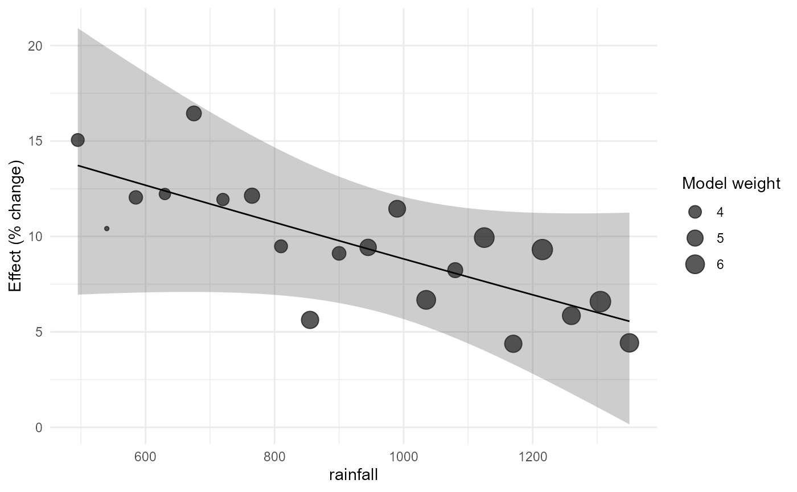
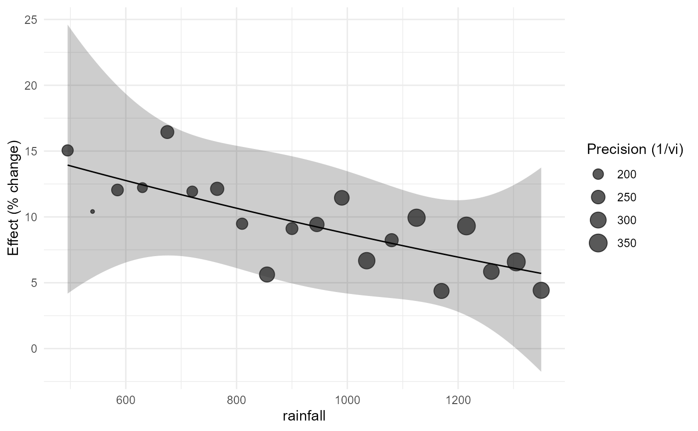

# Meta-regression and Quantitative Agronomic Moderators

## 1. Scientific role of a moderator

Meta-regression asks whether estimated treatment effects vary
systematically with study-level or experiment-level characteristics. It
does not turn observational differences among studies into randomized
treatment contrasts. In agronomy this distinction is central because
rainfall, temperature, soil texture, crop species, management intensity,
and dose can be associated with many other differences among
experiments.

Version 0.3.0 therefore separates three questions:

1.  **moderator meta-regression**, which describes effect modification
    across studies;
2.  **quantitative moderator curves**, which permit prespecified
    nonlinear associations while retaining the meta-analytic uncertainty
    model; and
3.  **dose-response meta-analysis**, treated separately in the next
    vignette, for multiple correlated dose contrasts within studies.

## 2. Build the effect-size data

``` r

irr_es <- apm_effect_size(irrigation_climate,"lnRR",m_t=mean_t,sd_t=sd_t,n_t=n_t,
  m_c=mean_c,sd_c=sd_c,n_c=n_c)
```

The effect measure is lnRR. Model coefficients are estimated on the
logarithmic scale, while plots and tables may later be translated to
ratios or percentage change.

## 3. Prespecified quantitative moderators

``` r

irr_m <- apm_metareg(irr_es, ~ rainfall + mean_temp)
irr_m
#> <apm_metareg> measure=lnRR | backend=metafor::rma.uni
#>       term    estimate
#>    intrcpt 0.091321634
#>   rainfall 0.001234469
#>  mean_temp 0.264530461
#> Residual QE: 1.9013  | meta-R2 (%): NA
apm_table(irr_m, component="metareg", transform="percent")
#>                term estimate    se ci_lower    ci_upper
#> intrcpt     intrcpt    9.562 0.014    6.352      12.869
#> rainfall   rainfall    0.124 0.021   -4.308       4.760
#> mean_temp mean_temp   30.282 4.295  -99.985 1122303.411
```

Numeric moderators are centered by default. Consequently, the intercept
corresponds to the expected effect near the observed mean values of
rainfall and temperature rather than at an agronomically irrelevant
rainfall of zero.

A second fit can be used to inspect whether scaling changes numerical
conditioning without changing the scientific model.

``` r

irr_scaled <- apm_metareg(irr_es, ~ rainfall + mean_temp, center=TRUE, scale=TRUE)
irr_scaled
#> <apm_metareg> measure=lnRR | backend=metafor::rma.uni
#>       term   estimate
#>    intrcpt 0.09132163
#>   rainfall 0.32864473
#>  mean_temp 0.35181648
#> Residual QE: 1.9013  | meta-R2 (%): NA
```

## 4. Categorical moderators and adjusted marginal effects

``` r

bio_es <- apm_effect_size(bioinoculant_multicrop,"lnRR",m_t=mean_t,sd_t=sd_t,n_t=n_t,
  m_c=mean_c,sd_c=sd_c,n_c=n_c)
bio_m <- apm_metareg(bio_es, ~ crop + site)
apm_marginal_effects(bio_m, variables="crop", transform="percent")
#> <apm_marginal> weights=equal | transform=percent
#>         crop     pred         se   ci_lower ci_upper   pi_lower pi_upper
#>  common_bean 6.523174 0.04309177 -2.6969728 16.61699 -2.6969728 16.61699
#>        maize 8.323358 0.01875818  4.1374156 12.67756  4.1374156 12.67756
#>      soybean 6.499606 0.03227482 -0.4824101 13.97147 -0.4824101 13.97147
#>        wheat 4.453785 0.03682445 -3.3226227 12.85570 -3.3226227 12.85570
apm_marginal_effects(bio_m, variables="site", transform="percent")
#> <apm_marginal> weights=equal | transform=percent
#>        site     pred         se   ci_lower ci_upper   pi_lower pi_upper
#>       Areia 7.513153 0.02772860  1.4288506 13.96243  1.4288506 13.96243
#>  Bananeiras 6.824014 0.02592614  1.1610659 12.80397  1.1610659 12.80397
#>  Lagoa Seca 5.002177 0.02484524 -0.3381281 10.62864 -0.3381281 10.62864
```

These are standardized predictions. They are preferable to interpreting
a coefficient table as though every coefficient were a directly adjusted
treatment effect.

## 5. Interactions

The scientific hypothesis should precede the interaction term. Here the
question is whether the irrigation effect changes with rainfall
differently among climate zones.

``` r

irr_i <- apm_metareg(irr_es, ~ rainfall * climate_zone)
apm_interaction(irr_i, "rainfall:climate_zone", at=list(rainfall=c(650,900,1200)))
#> <apm_interaction> rainfall:climate_zone | contrast=difference
#>                                     label       context      estimate
#>       slope_rainfall | climate_zone=humid  rainfall=650 -1.288665e-04
#>       slope_rainfall | climate_zone=humid  rainfall=900 -1.288665e-04
#>       slope_rainfall | climate_zone=humid rainfall=1200 -1.288665e-04
#>    slope_rainfall | climate_zone=semiarid  rainfall=650  1.238407e-05
#>    slope_rainfall | climate_zone=semiarid  rainfall=900  1.238407e-05
#>    slope_rainfall | climate_zone=semiarid rainfall=1200  1.238407e-05
#>  slope_rainfall | climate_zone=transition  rainfall=650 -6.213622e-05
#>  slope_rainfall | climate_zone=transition  rainfall=900 -6.213622e-05
#>  slope_rainfall | climate_zone=transition rainfall=1200 -6.213622e-05
#>            se      ci_lower     ci_upper   statistic df distribution   p_value
#>  0.0002451578 -0.0006546776 0.0003969446 -0.52564722 14            t 0.6073594
#>  0.0002451578 -0.0006546776 0.0003969446 -0.52564722 14            t 0.6073594
#>  0.0002451578 -0.0006546776 0.0003969446 -0.52564722 14            t 0.6073594
#>  0.0003714827 -0.0007843670 0.0008091352  0.03333688 14            t 0.9738766
#>  0.0003714827 -0.0007843670 0.0008091352  0.03333688 14            t 0.9738766
#>  0.0003714827 -0.0007843670 0.0008091352  0.03333688 14            t 0.9738766
#>  0.0002574490 -0.0006143095 0.0004900370 -0.24135349 14            t 0.8127802
#>  0.0002574490 -0.0006143095 0.0004900370 -0.24135349 14            t 0.8127802
#>  0.0002574490 -0.0006143095 0.0004900370 -0.24135349 14            t 0.8127802
#>  p_adjusted
#>   0.6073594
#>   0.6073594
#>   0.6073594
#>   0.9738766
#>   0.9738766
#>   0.9738766
#>   0.8127802
#>   0.8127802
#>   0.8127802
#> Joint interaction test:
#>   statistic df1 df2 distribution   p_value
#>  0.05299287   2  14            F 0.9485761
```

For log-ratio effects, interaction contrasts may also be returned as
ratios where scientifically meaningful.

``` r

apm_interaction(irr_i, "rainfall:climate_zone", contrast="ratio")
#> <apm_interaction> rainfall:climate_zone | contrast=ratio
#>                                     label        context  estimate           se
#>       slope_rainfall | climate_zone=humid rainfall=922.5 0.9998711 0.0002451578
#>    slope_rainfall | climate_zone=semiarid rainfall=922.5 1.0000124 0.0003714827
#>  slope_rainfall | climate_zone=transition rainfall=922.5 0.9999379 0.0002574490
#>   ci_lower ci_upper   statistic df distribution   p_value p_adjusted
#>  0.9993455 1.000397 -0.52564722 14            t 0.6073594  0.6073594
#>  0.9992159 1.000809  0.03333688 14            t 0.9738766  0.9738766
#>  0.9993859 1.000490 -0.24135349 14            t 0.8127802  0.8127802
#> Joint interaction test:
#>   statistic df1 df2 distribution   p_value
#>  0.05299287   2  14            F 0.9485761
```

## 6. Quantitative curves

A quadratic curve is useful only when motivated by the biological
question and supported by the observed moderator range.

``` r

irr_quad <- apm_metareg_curve(irr_es, rainfall, form="quadratic")
irr_quad
#> <apm_metareg> measure=lnRR | backend=metafor::rma.uni
#>     term      estimate
#>  intrcpt  9.036486e-02
#>  .apm_x1 -8.761799e-05
#>  .apm_x2  1.442002e-08
#> Residual QE: 1.9013  | meta-R2 (%): NA
apm_curve_features(irr_quad, features=c("slope","turning_point"))
#> <apm_curve_features>
#> Turning points:
#> [1] location        lower           upper           inside_support 
#> [5] interval_method
#> <0 rows> (or 0-length row.names)
#> Slope grid: 200 locations
#> Moderator-curve features are descriptive across-study associations and are not automatically causal dose recommendations.
```

A spline offers more flexibility but also consumes information and can
become unstable when few studies occupy parts of the range.

``` r

irr_ns <- apm_metareg_curve(irr_es, rainfall, form="ns", df=3)
apm_curve_features(irr_ns, features="slope")
#> <apm_curve_features>
#> Slope grid: 200 locations
#> Moderator-curve features are descriptive across-study associations and are not automatically causal dose recommendations.
```

[`apm_curve_features()`](https://wep69.github.io/agriPairMetaFlow/reference/apm_curve_features.md)
labels these quantities as descriptive across-study features. A turning
point is not automatically an agronomic optimum.

## 7. Context-specific prediction

``` r

ctx <- data.frame(rainfall=c(650,900,1200), mean_temp=c(26.2,25.0,23.7))
apm_predict_context(irr_m, ctx, transform="percent", threshold=5)
#> Warning: Extra argument ('prob') disregarded.
#> <apm_prediction> transform=percent
#>  rainfall mean_temp       support     pred        se  ci_lower  ci_upper
#>       650      26.2 interpolation 11.48706 0.1049708 -10.66087  39.12566
#>       900      25.0 interpolation 10.50814 0.1088469 -12.16656  39.03644
#>      1200      23.7 interpolation 13.47020 0.9619565 -85.09063 763.58382
#>   pi_lower  pi_upper threshold_relation probability_above_threshold
#>  -10.66087  39.12566           overlaps                          NA
#>  -12.16656  39.03644           overlaps                          NA
#>  -85.09063 763.58382           overlaps                          NA
#>                                               probability_basis
#>  unavailable: backend predictive-probability calculation failed
#>  unavailable: backend predictive-probability calculation failed
#>  unavailable: backend predictive-probability calculation failed
```

The output retains whether each context is an interpolation or
extrapolation relative to the fitted support. Prediction intervals, when
estimable, answer a different question from confidence intervals: they
describe uncertainty for a future context under the heterogeneity model.

## 8. Model comparison

Model comparison should be prespecified and interpreted together with
biological plausibility, support, residual heterogeneity, and
uncertainty.

``` r

m_lin <- apm_metareg(irr_es, ~ rainfall)
m_cov <- apm_metareg(irr_es, ~ rainfall + mean_temp)
apm_model_compare(m_lin, m_cov, criterion="AICc")
#> <apm_model_comparison> criterion=AICc
#>   model  k p   logLik       AIC      AICc       BIC    delta    weight
#>  model1 20 3 36.04221 -66.08443 -64.58443 -63.09723 0.000000 0.8294079
#>  model2 20 4 36.04411 -64.08822 -61.42156 -60.10529 3.162873 0.1705921
apm_model_compare(m_lin, m_cov, criterion="BIC")
#> <apm_model_comparison> criterion=BIC
#>   model  k p   logLik       AIC      AICc       BIC    delta    weight
#>  model1 20 3 36.04221 -66.08443 -64.58443 -63.09723 0.000000 0.8169725
#>  model2 20 4 36.04411 -64.08822 -61.42156 -60.10529 2.991939 0.1830275
```

The package does not perform automated stepwise selection.

## 9. Bubble plots

``` r

apm_bubble(m_lin, rainfall, transform="percent")
```



``` r

apm_bubble(irr_quad, rainfall, size="precision", transform="percent")
```



The points are observed effect sizes. The line is generated by the
fitted meta-regression; it is not a generic smoother.

## 10. Dependence-aware meta-regression

Nitrogen contrasts from the same experiment share the zero-N control.
Their sampling errors are correlated.

``` r

mz_es <- apm_effect_size(maize_n_shared,"lnRR",m_t=mean_t,sd_t=sd_t,n_t=n_t,
  m_c=mean_c,sd_c=sd_c,n_c=n_c)
mz_V <- apm_vcov(mz_es, cluster=experiment_id, shared_control=TRUE)
mz_m <- apm_metareg(mz_es, ~ N_rate + soil_texture, V=mz_V,
  random=~1|study_id/effect_id)
apm_marginal_effects(mz_m, variables="soil_texture", weights="study", transform="percent")
#> <apm_marginal> weights=study | transform=percent
#>  soil_texture     pred         se ci_lower ci_upper pi_lower pi_upper
#>          clay 9.407854 0.03134488 2.483151 16.80045       NA       NA
#>          loam 9.247484 0.02928991 2.772532 16.13038       NA       NA
#>         sandy 9.836766 0.03578598 1.936194 18.34967       NA       NA
```

Ignoring `mz_V` would treat several contrasts that reuse the same
control as if their sampling errors were independent.

## 11. Recommended interpretation sequence

For an agronomic meta-regression, report at least:

1.  the prespecified moderator hypothesis;
2.  the effect-size scale;
3.  whether effects were independent or correlated;
4.  moderator coefficients or adjusted marginal predictions with
    intervals;
5.  residual heterogeneity;
6.  the observed moderator support;
7.  prediction intervals where identifiable;
8.  whether predictions represent interpolation or extrapolation; and
9.  a clear distinction between across-study association and causal dose
    response.
